<a name="readme-top"></a>

# M3D — Operational Intelligence Runtime

**An open-source runtime for safe, autonomous AI operations.**

[](https://github.com/M3DMedia/M3D/blob/main/LICENSE)
[](https://www.python.org/)
[](https://github.com/M3DMedia/M3D/stargazers)
[](https://github.com/M3DMedia/M3D/issues)

[Quick Start](#quick-start) · [Architecture](#architecture) · [Safety Model](#safety-model) · [Roadmap](#roadmap) · [Contributing](#contributing)

---

## Current Status

> **M3D v1.0.0 — Foundational Release**

The initial release establishes the operational domain model, safety architecture, environment abstraction, orchestration, CLI, and real-environment testing.

M3D is an open-source Python runtime for building operational intelligence systems that can observe real environments, investigate problems, reason about possible causes, apply policy and risk controls, execute authorized actions, verify outcomes, and maintain an auditable operational history.

M3D is designed to sit between **AI reasoning and real-world operations**.

> **AI may reason about the environment, but M3D owns operational truth, policy, execution, verification, and auditability.**

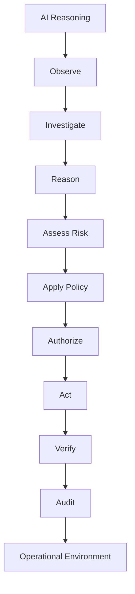

---

## Why M3D?

AI systems are becoming increasingly capable of reasoning, planning, and using tools.

The difficult part is what happens when an AI system interacts with a real environment.

An operational system needs to know:

- What exists?
- What changed?
- What is affected?
- What evidence supports a conclusion?
- What could be causing the problem?
- What actions are permitted?
- What risks are involved?
- Who authorized an action?
- What actually happened?
- Did the action achieve its intended result?
- What should be recorded for future investigation?

M3D provides structured runtime primitives for answering these questions.

Its core principle is:

> **AI may reason about the environment, but M3D owns operational truth, policy, execution, verification, and auditability.**

---

## What M3D Is

M3D is designed to sit between **AI reasoning and real-world operations**.

The goal is not to build another chatbot, generic agent framework, monitoring dashboard, or infrastructure automation tool.

The goal is to provide the **operational foundation that allows intelligent systems to safely understand and act on real environments**.

M3D provides reusable primitives for:

- 🔍 Structured operational investigation
- 🧠 Evidence-based reasoning
- 🛡️ Policy enforcement
- ⚠️ Risk assessment
- 🔐 Explicit authorization
- ⚙️ Controlled execution
- ✅ Outcome verification
- 📜 Operational auditability
- 🔌 Extensible environment integrations
- 🧪 Testing and evaluation

---

## What Makes M3D Different

M3D treats operations as a structured lifecycle rather than a sequence of AI tool calls.


Each stage is represented by explicit domain objects and controlled through dedicated engines and interfaces.

This creates a separation between:

| Responsibility | M3D |
|---|---|
| AI reasoning | Intelligence |
| Operational state | Source of truth |
| Evidence | Provenance |
| Investigation | Structured reasoning process |
| Policy | Authority |
| Risk | Consequence assessment |
| Authorization | Permission |
| Action | Execution intent |
| Action Result | Execution outcome |
| Verification | Proof |
| Audit | Accountability |

This separation is fundamental to the architecture.

---

# Core Concepts

M3D models operational environments using explicit domain concepts.

### Environment

An operational boundary such as:

- Linux server
- macOS workstation
- Windows system
- VMware infrastructure
- Docker environment
- Kubernetes cluster
- Database
- Cloud environment
- Network
- AI agent
- Web application

### Entity

An object inside an environment.

Examples:

- Host
- VM
- Process
- Container
- Service
- Database
- User
- AI agent

### Relationship

A first-class relationship between entities.

Examples:

```text
HOSTS
DEPENDS_ON
RUNS_ON
CONNECTS_TO
```

### Event

An immutable fact describing something that happened or changed.

Events contain information such as:

- timestamp
- source
- entity
- event type
- previous state
- new state
- severity
- metadata
- correlation ID

### Investigation

A structured process for understanding an operational situation.

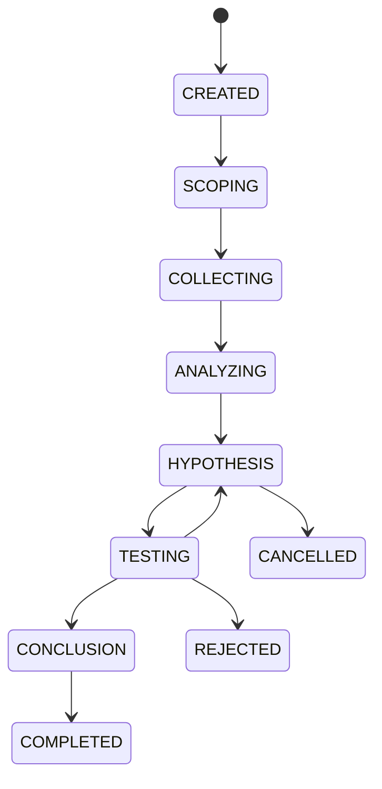

### Evidence

Information supporting or weakening a hypothesis.

Evidence maintains provenance so that conclusions can be traced back to observations.

### Hypothesis

A possible explanation for an observed situation.

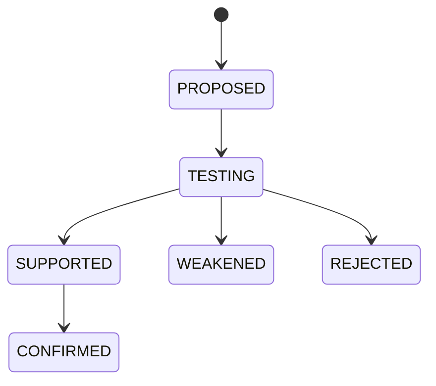

A supported hypothesis is not automatically confirmed. Confirmation requires sufficient evidence.

### Decision

A determination of what should happen.

A decision is separate from the reasoning that produced it and from the action that may eventually implement it.

### Risk

An independent assessment of potential consequences.

Risk considers factors such as:

- severity
- probability
- impact
- reversibility
- affected entities
- mitigation
- required authorization

### Policy

Rules governing what the system is allowed to do.

Policies can:

```text
ALLOW
DENY
REQUIRE_APPROVAL
```

AI reasoning cannot override policy.

### Policy Evaluation

The result of evaluating an action or decision against applicable policy.

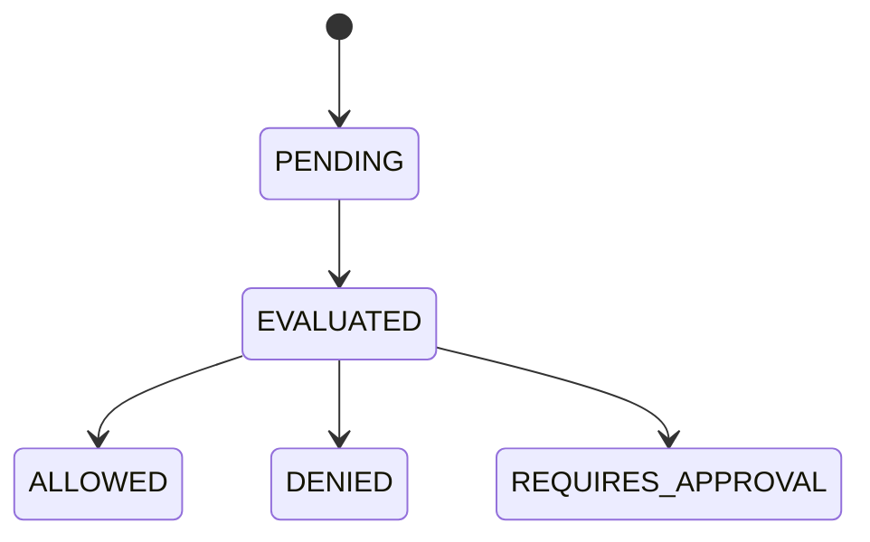

Policy evaluation is deliberately separate from policy definition.

### Authorization

Permission to perform an operational action.

Authorization is deliberately separate from the decision itself.

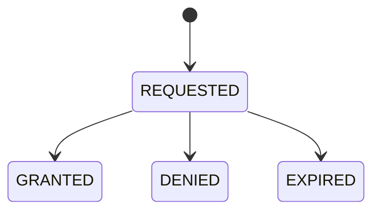

### Action

An intended operational operation.

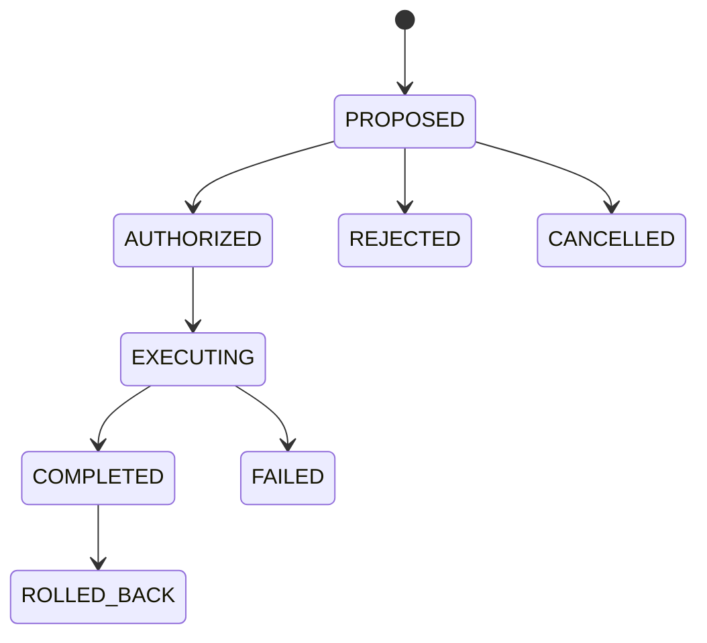

### Action Result

The observed result of executing an action.

Execution success is not automatically considered operational success.

### Verification

Verification determines whether the intended outcome actually occurred.

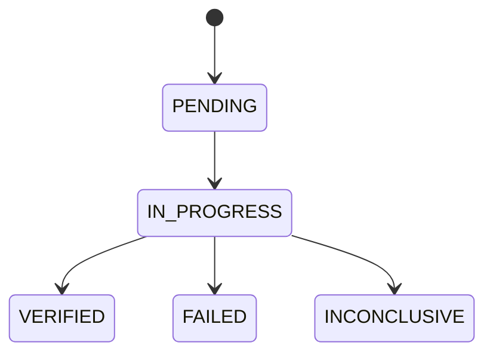

### Audit

M3D maintains an immutable operational history.

The audit layer records what happened, who or what initiated it, why it happened, and how the operation progressed.

---

# Architecture

M3D uses a ports-and-adapters architecture that keeps the operational core independent from infrastructure, storage, and AI providers.

The architecture is built around a strict separation of responsibilities:

- **Domain** defines operational truth and state.
- **Ports** define contracts between the core and external capabilities.
- **Engines** implement investigation, policy, risk, action, verification, and audit behavior.
- **Adapters** connect those contracts to real environments, storage systems, event buses, and reasoning providers.
- **Orchestration** coordinates complete operational workflows.
- **Interfaces** expose M3D to users and external systems.

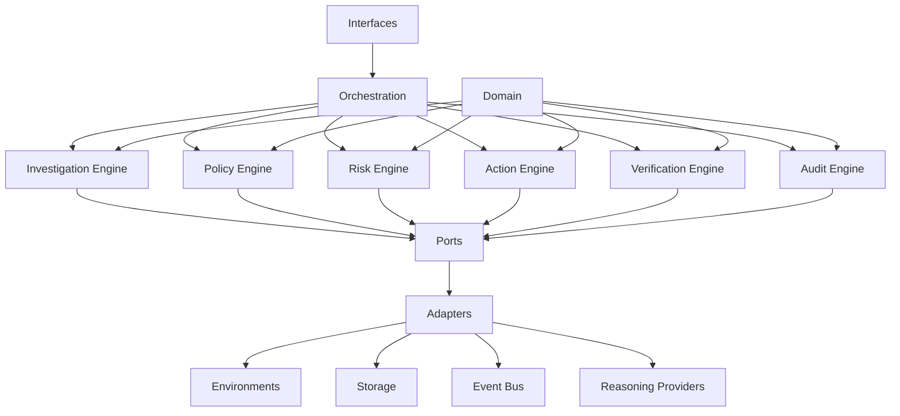

The important boundary is between the **M3D core** and its adapters.

The domain does not know whether an operation targets Linux, macOS, Windows, VMware, Docker, Kubernetes, a database, or a cloud environment. It works with stable domain models and explicit port contracts.

Environment integrations are implemented as adapters:

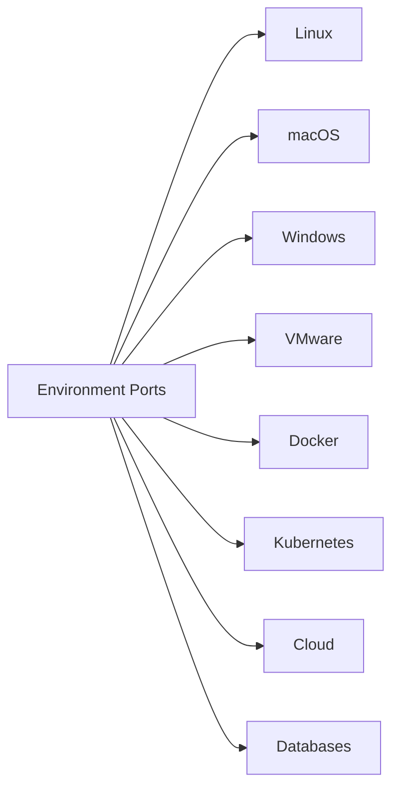

The same principle applies to other replaceable capabilities:

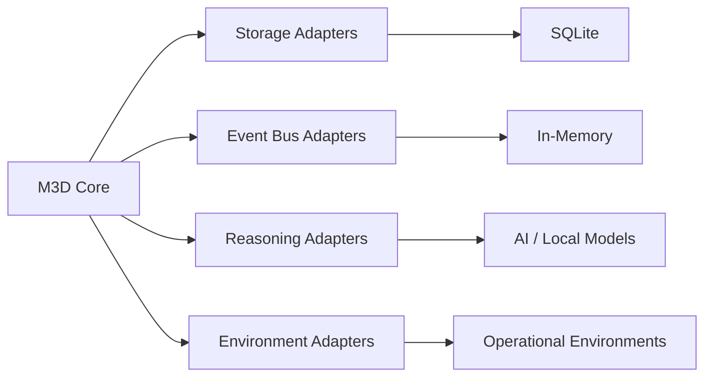

This allows infrastructure and AI providers to evolve without forcing provider-specific concerns into the operational domain.

---

## Architectural Layers

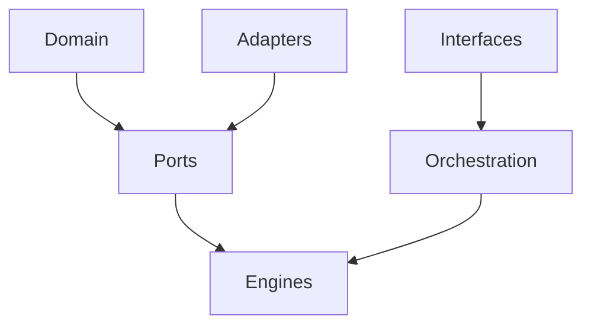

### Domain

The domain contains the operational model: environments, entities, events, investigations, evidence, hypotheses, decisions, risk, policy, authorization, actions, results, verification, and audit records.

### Ports

Ports define contracts for capabilities such as environment access, storage, reasoning, event publication, authorization, execution, verification, and audit.

### Engines

Engines implement operational behavior while remaining independent of concrete infrastructure.

### Adapters

Adapters implement ports for specific environments and technologies.

### Orchestration

Orchestration coordinates complete operational flows across the engines. It does not replace the domain or the engines.

### Interfaces

Interfaces expose M3D capabilities to users and external systems, including the command-line interface.

This structure keeps the core testable, replaceable, and extensible while allowing new environments, providers, and interfaces to be added independently.

---

# AI Is Not the Source of Truth

M3D deliberately separates intelligence from operational authority.

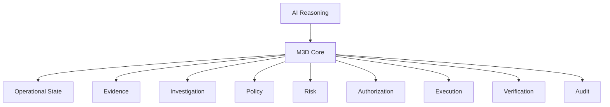

AI reasoning providers can be replaced without changing the operational model.

Potential providers include:

- OpenAI
- Anthropic
- Local models
- Future reasoning systems

The AI layer can propose hypotheses, investigation steps, conclusions, and decisions.

The M3D core remains responsible for operational state, evidence, policy, authorization, execution, verification, and audit.

---

# Safety Model

M3D is designed around controlled autonomy.

An intelligent system should not simply:

```text
AI → Tool → Command
```

Instead:


This allows systems to operate with different autonomy levels.

### Observation Only

The system can inspect environments and collect information.

### Investigation

The system can investigate operational situations and develop hypotheses.

### Recommendation

The system can propose actions without executing them.

### Approval-Based Operations

The system can execute actions after explicit authorization.

### Controlled Autonomy

The system can execute pre-authorized classes of low-risk actions while maintaining verification and auditability.

The runtime is designed so that increasing autonomy does not require removing the safety model.

---

# Environment Abstraction

M3D environments expose structured capabilities through environment plugins.

Conceptually:

```text
identify()
discover()
observe()
collect()
execute()
verify()
```

This makes it possible to use the same operational model across different environments.

The initial implementation includes:

- macOS environment support
- Linux environment support
- environment discovery
- environment observation
- environment data collection
- controlled execution interfaces
- outcome verification

Additional adapters can be added without changing the core operational model.

---

# M3D v1.0.0

The initial release establishes the foundational operational model.

Current capabilities include:

- immutable operational domain models
- environments
- entities
- relationships
- events
- investigations
- evidence
- hypotheses
- decisions
- risk assessment
- policies
- policy evaluation
- authorization
- actions
- action results
- verification
- audit records
- investigation persistence interfaces
- event bus interfaces
- environment plugin interfaces
- reasoning interfaces
- policy engine
- risk engine
- action engine
- verification engine
- audit engine
- operational orchestration
- macOS environment integration
- Linux environment integration
- command-line interface
- unit testing
- integration testing
- real-environment macOS testing

The project is intentionally foundational at this stage.

M3D v1.0.0 is **not positioned as a production autonomous IT operations platform yet**.

It establishes the architecture and primitives required to build one.

---

# Quick Start

After installation, inspect your local environment:

```bash
m3d env info
```

Discover the entities M3D can currently see:

```bash
m3d env list
```

Observe the latest environment events:

```bash
m3d env events
```

Collect detailed host information:

```bash
m3d env get host
```

A typical flow looks like:

```text
$ m3d env info
Environment: macos_local

$ m3d env list
HOST
  id: entity_...
  name: your-host
  status: online
```

This is intentionally small in v1:

**connect → observe → inspect**

The same environment abstraction will later support investigation, policy-controlled actions, verification, and autonomous operational workflows.

---

# Command Line Interface

M3D currently provides a lightweight CLI.

Show available commands:

```bash
m3d --help
```

Show information about the connected environment:

```bash
m3d env info
```

List discovered entities:

```bash
m3d env list
```

Display observed events:

```bash
m3d env events
```

Collect detailed information about the host:

```bash
m3d env get host
```

The CLI will evolve alongside the runtime.

---

# Installation

Clone the repository:

```bash
git clone https://github.com/M3DMedia/M3D.git
cd M3D
```

Create a Python environment:

```bash
conda create -n m3d python=3.13
conda activate m3d
```

Install M3D in editable mode:

```bash
pip install -e .
```

Install development dependencies:

```bash
pip install -e ".[dev]"
```

Run the test suite:

```bash
pytest
```

---

# Development

M3D currently targets Python 3.13+.

Development tooling includes:

- pytest
- pytest-cov
- Ruff
- mypy

Check code quality with:

```bash
ruff check .
```

Run type checking with:

```bash
mypy src
```

Run tests with:

```bash
pytest
```

The project maintains strict separation between domain logic, interfaces, engines, and infrastructure adapters.

---

# Testing

M3D is being developed with testing as part of the architecture rather than as a final validation step.

The test suite covers:

```text
tests/
├── unit/
├── integration/
├── scenarios/
└── benchmarks/
```

The v1 development baseline includes hundreds of automated tests covering the domain model, engines, ports, adapters, orchestration, and real macOS integration.

Real-environment testing is especially important because operational software must be validated against actual systems rather than only mocked environments.

---

# Project Structure

```text
M3D/
├── src/m3d/
│   ├── domain/
│   │   ├── environment/
│   │   ├── entity/
│   │   ├── relationship/
│   │   ├── event/
│   │   ├── investigation/
│   │   ├── evidence/
│   │   ├── hypothesis/
│   │   ├── decision/
│   │   ├── risk/
│   │   ├── policy/
│   │   ├── policy_evaluation/
│   │   ├── authorization/
│   │   ├── action/
│   │   ├── action_result/
│   │   ├── verification/
│   │   ├── audit/
│   │   └── common/
│   ├── ports/
│   ├── engines/
│   ├── adapters/
│   ├── runtime/
│   └── interfaces/
│       └── cli/
├── tests/
│   ├── unit/
│   ├── integration/
│   ├── scenarios/
│   └── benchmarks/
├── examples/
├── docs/
├── benchmarks/
├── pyproject.toml
├── README.md
├── CONTRIBUTING.md
├── SECURITY.md
├── LICENSE
└── .gitignore
```

---

# Who Is M3D For?

M3D is intended for people building systems that need to reason about and operate real environments.

### Developers

Building AI-powered operational systems without having to reinvent:

- state management
- investigation models
- policy enforcement
- authorization
- execution
- verification
- auditability

### AI Engineers

Building agents that need to interact with real infrastructure while maintaining explicit operational controls.

### Platform and Infrastructure Teams

Creating automation and operational intelligence systems across heterogeneous environments.

### Security Teams

Building systems where actions require explicit policy, authorization, verification, and audit trails.

### Companies

Using M3D as an open foundation for internal operational intelligence systems or commercial products.

### Researchers

Experimenting with:

- autonomous operations
- AI reasoning
- agent safety
- operational decision making
- verification
- human-in-the-loop systems
- AI evaluation

---

# Roadmap

The project is expected to evolve through several stages.

## v1 — Foundation

Establish the operational model and core architecture.

```text
Domain
Ports
Engines
Adapters
Orchestration
CLI
Testing
```

## v1.x — Runtime

Introduce the runtime layer that connects the foundational components into a coherent operational execution environment.

Potential areas include:

- event-driven orchestration
- persistent runtime state
- scheduling
- operational workflows
- richer environment discovery
- plugin management
- runtime configuration

## v2 — Autonomous Operations

Expand reasoning and operational capabilities.

Potential areas include:

- advanced investigations
- multi-step operations
- autonomous remediation
- multi-agent coordination
- operational memory
- richer verification
- simulation environments
- policy-driven autonomy

## Future

The long-term direction is an ecosystem around operational intelligence.

Potential components include:

```text
M3D Core
    │
    ├── Environment Plugins
    ├── Reasoning Providers
    ├── Policy Packs
    ├── Operational Playbooks
    ├── Verification Modules
    ├── Benchmarks
    ├── Integrations
    └── Community Knowledge
```

---

# Contributing

M3D is intended to become a community-driven project.

Contributions are welcome across:

- Python development
- environment adapters
- AI reasoning integrations
- policy systems
- verification
- testing
- benchmarks
- documentation
- security
- operational research
- examples and use cases

The project is especially interested in contributors who want to explore the boundary between **AI reasoning and safe real-world action**.

See `CONTRIBUTING.md` for development guidelines.

---

# Design Principles

M3D is built around several principles.

### 1. AI should not own operational truth

Models can reason about state, but the runtime maintains the authoritative operational model.

### 2. Actions must be controlled

Execution should pass through policy, risk, authorization, and verification.

### 3. Evidence matters

Conclusions should be traceable to observations and evidence.

### 4. Verification is part of the operation

A successful command is not necessarily a successful operation.

### 5. Auditability is part of the architecture

Operational history should not be an afterthought.

### 6. Environments should be replaceable

The core should not be coupled to a specific infrastructure provider.

### 7. Autonomy should be controllable

The system should support human oversight and progressively increasing levels of autonomy.

### 8. The architecture should remain extensible

New environments, AI providers, policies, verification methods, and operational capabilities should be addable without rewriting the core.

---

# Community

M3D is an open-source project and welcomes:

- ⭐ Stars and follows
- 🐛 Bug reports
- 💡 Feature proposals
- 🔌 Plugin contributions
- 🧪 Experiments and benchmarks
- 🔧 Pull requests
- 💬 Architecture discussions

Useful starting points:

- [Repository](https://github.com/M3DMedia/M3D)
- [Issues](https://github.com/M3DMedia/M3D/issues)
- [Discussions](https://github.com/M3DMedia/M3D/discussions)

If M3D is useful to you, a GitHub star helps other developers discover the project.

---

# Security

Operational software requires a strong security model.

Security issues should be reported responsibly rather than disclosed publicly as ordinary GitHub issues.

See `SECURITY.md` for the project security policy.

---

# License

M3D is released under the **Apache License 2.0**.

See `LICENSE` for the complete license text.

---

# The Vision

The future of AI operations should not be:

```text
AI → Tool → Command
```

It should be:

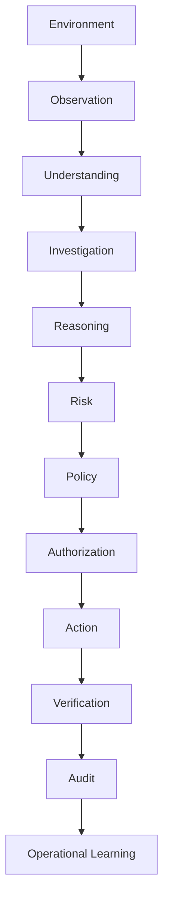

M3D is being built to provide the runtime underneath that model.

The long-term goal is an open ecosystem where developers, companies, researchers, and infrastructure teams can build increasingly capable operational intelligence systems on top of a common, auditable foundation.

**M3D — Operational Intelligence Runtime.**
